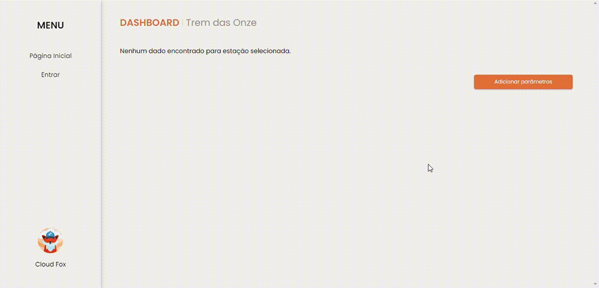

<h1 align="center">Sprint 3: 17/10/2022 a 06/11/2022</h1>

    <a href="#objetivos">Objetivos da sprint</a> &nbsp |&nbsp &nbsp
    <a href="#entregas">Entregas</a> &nbsp |&nbsp &nbsp
    <a href="#metricas">Métricas do time</a> &nbsp |&nbsp &nbsp
    <a href="#links">Links úteis</a>

Nesta terceira sprint a equipe prosseguiu no desenvolvimento dos requisitos planejados para a sprint, como a recepção dos dados das estações, além de implementar melhorias estruturais na plataforma (a nível de código), ajustar detalhes (no login, dashboard e cadastro de estações, por exemplo) e alterando as ferramentas utilizadas para o deploy da aplicação (removendo o servidor do Render e trazendo-o para a AWS).

    
## :dart: Objetivos da Sprint
Os requisitos (tanto do cliente como da instituição de ensino) abrangidos por essa sprint são:

- :heavy_check_mark: **RF 04:** Recepção dos dados das estações meteorológicas
- :heavy_check_mark: **RF 07:** Geração de alertas
- :heavy_check_mark: **RNF 06:** Tutorial do significado de cada parâmetro meteorológico

        
## 🌤 Entregas
O foco do desenvolvimento se deu na comunicação entre o datalogger e o sistema, assim como a geração de alertas e tutoriais, mas também houveram grandes esforços para ajustes de detalhes no sistema, visando melhorar a experiência do usuário com a plataforma. Confira abaixo os resultados desta entrega:

### 🌪 RF 04: Recepção dos dados das estações meteorológicas

Este requisito se trata da comunicação entre o datalogger (que retém os dados criados pelas estações meteorológicas) e o nosso sistema, sendo assim foi criado um mecanismo que simula uma estação meteorológica enviando dados a cada 1h para o servidor, este que cadastra as coletas e disponibiliza para a visualização das mesmas na plataforma. O arquivo com o código fonte pode ser encontrado no repositório de IoT do projeto, ou por [este link](https://github.com/The-Bugger-Ducks/cloud-fox-iot).

### ⚡️ RF 07: Geração de alertas

Tal requisito se trata da possibilidade de criar alertas que relacionam um parâmetro meteorológico a um determinado limite, seja mínimo ou máximo, assim, caso os valores ultrapassem esta faixa, um alerta seria gerado automaticamente como forma de notificação do ocorrido, porém este requisito não foi trabalhado durante a sprint, sendo transferido para a próxima e última sprint do projeto.

### ☔️ RNF 06: Tutorial do significado de cada parâmetro meteorológico

Este requisito não funcional se trata da criação de tutoriais para explanação dos significados dos parâmetros meteorológicos manipulados visando auxiliar no aprendizado, entendimento e interpretação dos dados apresentados na plataforma em forma de gráficos, no entanto este requisito não foi trabalhado durante a sprint (apenas foi selecionado um modelo a ser usado de inspiração, por parte do cliente), dessa forma esse épico foi transferido para a próxima e última sprint do projeto.

### ✨ Melhorias

Englobando o ajuste de detalhes e criação de algumas funcionalidades, as melhorias foram feitas visando melhor interação e utilidade da plataforma. As mudanças implementadas foram:

- [x] **Deploy na AWS:** feito por uma action do GitHub Actions, onde foi criado um ambiente linux com as configurações necessárias para rodar o projeto, assim, instala-se as dependências, verifica-se os testes e, caso tudo estiver ok, é gerado o build do projeto e a transferência para o servidor na AWS

- [x] **Cadastro de parâmetros:** foi criado um modal para cadastro de parâmetros de uma estação, onde se pode cadastrar quantos parâmetros forem necessários, com nome, apelido, fator e unidade, e depois os associar à estação

</img>

- [x] **Edição de estação:** foi criado um modal que permite alterar nome, descrição e localização (lat, lng) de uma estação

</img>

- [x] **Ajustes na responsividade do projeto:** foram refeitas algumas das adequações do sistema para diferentes tamanhos de tela

- [x] **Ajustes no login social:** foram retiradas as opções de login com Apple e Facebook (como o acordado com o cliente) e ajustado algumas pendências relacionadas ao login social do Google.

- [x] **Refatorações no back para captura de erros:** foram aplicados métodos de captura de erros para futuros tratamentos e análise dos mesmos quando ocorrem, via blocos de código "try catch" e testes unitários, por exemplo

- [x] **Implementação de testes unitários (no frontend e no backend):** como parte da entrega de CI do projeto, foram criados alguns testes unitários no projeto, sendo utilizado o Jest (frontend) e o Vitest (backend)

→ [Voltar ao topo](#topo)

    
## :chart_with_upwards_trend: Métricas do time
Em prol de um melhor aproveitamento das habilidades de cada integrante, o time foi separado em duas frentes: frontend e backend, onde o "time front" realizou ajustes de forma a melhorar a UX do sistema, criou interfaces para edição de estações e regulou questões acerca do login social. Já o "time back" atuou na comunicação datalogger-sistema, além de criar determinados endpoints para os novos requisitos e alteração de ferramentas utilizadas no deploy. 
- O acompanhamento de atividades, de responsabilidade da Scrum Master, se encontra na imagem adiante, que contém o gráfico Burndown gerado pela equipe (onde o eixo X são os dias trabalhados na sprint e os valores do eixo Y representam as entregas e esforços realizados com o passar do tempo), incluindo as atividades desenvolvidas e seus responsáveis.
    

    

 
Lista de atividades desenvolvidas (com estimativa, responsável e datas)

  

 

    

    
## :link: Links úteis

- Site do projeto: [https://cloud-fox.netlify.app/](https://cloud-fox.netlify.app/)
- Tags geradas em cada repositório que simbolizam o fim da 3ª sprint:
  - Repositório do site: [clique aqui para acessar "cloud-fox-web"](https://github.com/The-Bugger-Ducks/cloud-fox-web)
  - Repositório da API: [clique aqui para acessar "cloud-fox-back"](https://github.com/The-Bugger-Ducks/cloud-fox-back)
  - Repositório do datalogger: [clique aqui para acessar "cloud-fox-iot"](https://github.com/The-Bugger-Ducks/cloud-fox-iot)

→ [Voltar ao topo](#topo)
